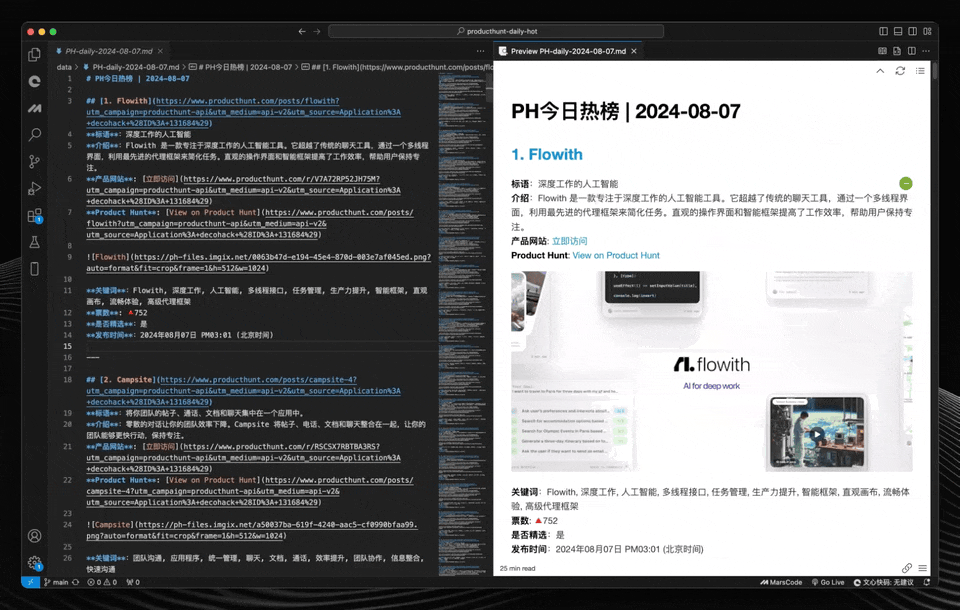

# Product Hunt 每日中文热榜

[English](README.en.md) | [中文](README.md)

 

Product Hunt 每日热榜是一个基于 GitHub Action 的自动化工具，它能够每天定时生成 Product Hunt 上的热门产品榜单 Markdown 文件，并自动提交到 GitHub 仓库中。该项目旨在帮助用户快速查看每日的 Product Hunt 热门榜单，并提供更详细的产品信息。

榜单会在每天下午4点自动更新，可以在 [🌐 这里查看](https://decohack.com/category/producthunt/https://decohack.com/category/producthunt/)。

## 预览



## 功能概述

- **自动获取数据**：每天自动获取前一天的 Product Hunt Top 30 产品数据。
- **关键词生成**：生成简洁易懂的中文关键词，帮助用户更好地理解产品内容。
- **高质量翻译**：使用 OpenAI 的 GPT-4 模型对产品描述进行高质量翻译。
- **Markdown 文件生成**：生成包含产品数据、关键词和翻译描述的 Markdown 文件，方便在网站或其他平台上发布。
- **每日自动化**：通过 GitHub Actions 自动生成并提交每日的 Markdown 文件。
- **可配置工作流**：支持手动触发或通过 GitHub Actions 定时生成内容。
- **灵活定制**：脚本易于扩展或修改，可以包括额外的产品细节或调整文件格式。

## 快速开始

### 前置条件

- Python 3.x
- GitHub 账户及仓库
- OpenAI API Key
- Product Hunt API 凭证

### 安装

1. **克隆仓库：**

```bash
git clone https://github.com/ViggoZ/producthunt-daily-hot.git
cd producthunt-daily-hot
```

2. **安装 Python 依赖：**

确保您的系统已安装 Python 3.x。然后安装所需的依赖包：

```bash
pip install -r requirements.txt
```

### 设置

1. **GitHub Secrets：**

   在您的 GitHub 仓库中添加以下 Secrets：

   - `OPENAI_API_KEY`: 您的 OpenAI API 密钥。
   - `PRODUCTHUNT_CLIENT_ID`: 您的 Product Hunt API 客户端 ID。
   - `PRODUCTHUNT_CLIENT_SECRET`: 您的 Product Hunt API 客户端密钥。
   - `PAT`: 用于推送更改到仓库的个人访问令牌。

2. **GitHub Actions 工作流：**

   工作流定义在 `.github/workflows/generate_markdown.yml` 中。该工作流每天 UTC 时间 08:01（北京时间 16:01）自动运行，也可以手动触发。

### 使用

设置完成后，GitHub Action 将自动生成并提交包含 Product Hunt 每日热门产品的 Markdown 文件。文件存储在 `data/` 目录下。

### 自定义

- 您可以修改 `scripts/product_hunt_list_to_md.py` 文件来自定义生成文件的格式或添加额外内容。
- 如果需要，可以在 `.github/workflows/generate_markdown.yml` 中调整定时任务的运行时间。

### 示例输出

生成的文件存储在 `data/` 目录下。每个文件以 `PH-daily-YYYY-MM-DD.md` 的格式命名。

### 贡献

欢迎任何形式的贡献！如有任何改进或新功能的建议，请提交 issue 或 pull request。

### 许可证

本项目基于 MIT 许可证开源 - 有关详细信息，请参阅 [LICENSE](LICENSE) 文件。